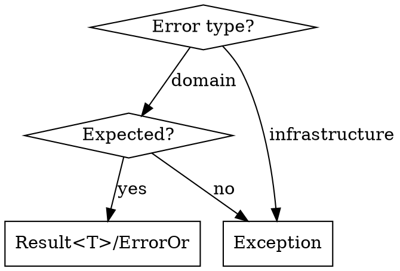
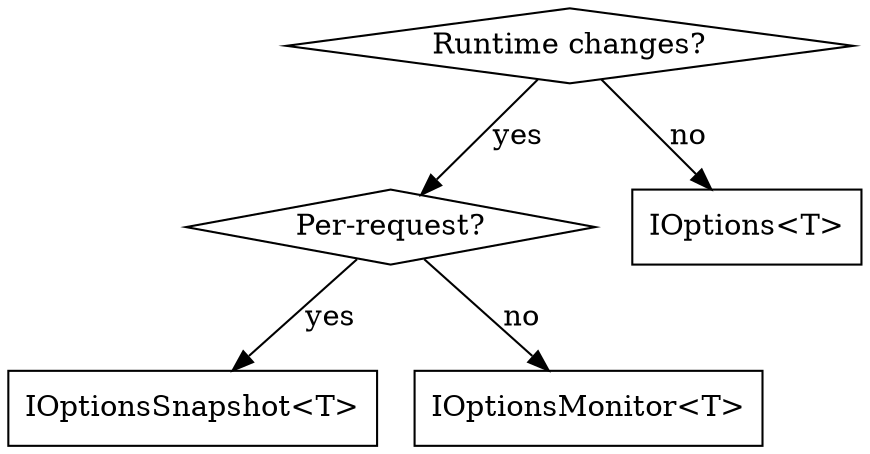
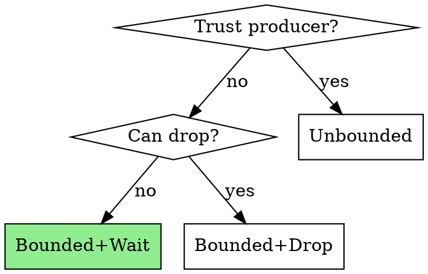

# .NET 10 & C# 14 Best Practices

.NET 10 (LTS, Nov 2025) with C# 14. Covers minimal APIs, not MVC.

**Official docs:** [.NET 10](https://learn.microsoft.com/en-us/dotnet/core/whats-new/dotnet-10/overview) | [C# 14](https://learn.microsoft.com/en-us/dotnet/csharp/whats-new/csharp-14) | [ASP.NET Core 10](https://learn.microsoft.com/en-us/aspnet/core/release-notes/aspnetcore-10.0)

## Detail Files

| File | Topics |
|------|--------|
| [csharp-14.md](csharp-14.md) | Extension blocks, `field` keyword, null-conditional assignment |
| [minimal-apis.md](minimal-apis.md) | Validation, TypedResults, filters, modular monolith, vertical slices |
| [security.md](security.md) | JWT auth, CORS, rate limiting, OpenAPI security, middleware order |
| [infrastructure.md](infrastructure.md) | Options, resilience, channels, health checks, caching, Serilog, EF Core, keyed services |
| [testing.md](testing.md) | WebApplicationFactory, integration tests, auth testing |
| [anti-patterns.md](anti-patterns.md) | HttpClient, DI captive, blocking async, N+1 queries |
| [libraries.md](libraries.md) | MediatR, FluentValidation, Mapster, ErrorOr, Polly, Aspire |

---

## Quick Start

```xml
<Project Sdk="Microsoft.NET.Sdk.Web">
  <PropertyGroup>
    <TargetFramework>net10.0</TargetFramework>
    <LangVersion>14</LangVersion>
    <Nullable>enable</Nullable>
  </PropertyGroup>
</Project>
```

```csharp
var builder = WebApplication.CreateBuilder(args);

// Core services
builder.Services.AddValidation();
builder.Services.AddProblemDetails();
builder.Services.AddOpenApi();

// Security
builder.Services.AddAuthentication().AddJwtBearer();
builder.Services.AddAuthorization();
builder.Services.AddRateLimiter(opts => { /* see security.md */ });

// Infrastructure
builder.Services.AddHealthChecks();
builder.Services.AddOutputCache();

// Modules
builder.Services.AddUsersModule();

var app = builder.Build();

// Middleware (ORDER MATTERS - see security.md)
app.UseExceptionHandler();
app.UseHttpsRedirection();
app.UseCors();
app.UseRateLimiter();
app.UseAuthentication();
app.UseAuthorization();
app.UseOutputCache();

app.MapOpenApi();
app.MapHealthChecks("/health");
app.MapUsersEndpoints();
app.Run();
```

---

## Decision Flowcharts

### Result vs Exception



### IOptions Selection



### Channel Type



---

## Key Patterns Summary

### C# 14 Extension Blocks
```csharp
extension<T>(IEnumerable<T> source)
{
    public bool IsEmpty => !source.Any();
}
```

### .NET 10 Built-in Validation
```csharp
builder.Services.AddValidation();
app.MapPost("/users", (UserDto dto) => TypedResults.Ok(dto));
```

### TypedResults (Always Use)
```csharp
app.MapGet("/users/{id}", async (int id, IUserService svc) =>
    await svc.GetAsync(id) is { } user
        ? TypedResults.Ok(user)
        : TypedResults.NotFound());
```

### Module Pattern
```csharp
public static class UsersModule
{
    public static IServiceCollection AddUsersModule(this IServiceCollection s) => s
        .AddScoped<IUserService, UserService>();

    public static IEndpointRouteBuilder MapUsersEndpoints(this IEndpointRouteBuilder app)
    {
        var g = app.MapGroup("/api/users").WithTags("Users");
        g.MapGet("/{id}", GetUser.Handle);
        return app;
    }
}
```

### HTTP Resilience
```csharp
builder.Services.AddHttpClient<IApi, ApiClient>()
    .AddStandardResilienceHandler();
```

### Error Handling (RFC 9457)
```csharp
builder.Services.AddProblemDetails();
app.UseExceptionHandler();
app.UseStatusCodePages();
```

---

## MANDATORY Patterns (Always Use These)

| Task | ✅ ALWAYS Use | ❌ NEVER Use |
|------|--------------|--------------|
| Extension members | C# 14 `extension<T>()` blocks | Traditional `this` extension methods |
| Property validation | C# 14 `field` keyword | Manual backing fields |
| Null assignment | `obj?.Prop = value` | `if (obj != null) obj.Prop = value` |
| API returns | `TypedResults.Ok()` | `Results.Ok()` |
| Options validation | `.ValidateOnStart()` | Missing validation |
| HTTP resilience | `AddStandardResilienceHandler()` | Manual Polly configuration |
| Timestamps | `DateTime.UtcNow` | `DateTime.Now` |

---

## Quick Reference Card

```
┌─────────────────────────────────────────────────────────────────┐
│                    .NET 10 / C# 14 PATTERNS                      │
├─────────────────────────────────────────────────────────────────┤
│ EXTENSION PROPERTY:  extension<T>(IEnumerable<T> s) {           │
│                        public bool IsEmpty => !s.Any();         │
│                      }                                          │
├─────────────────────────────────────────────────────────────────┤
│ FIELD KEYWORD:       public string Name {                       │
│                        get => field;                            │
│                        set => field = value?.Trim();            │
│                      }                                          │
├─────────────────────────────────────────────────────────────────┤
│ OPTIONS VALIDATION:  .BindConfiguration(Section)                │
│                      .ValidateDataAnnotations()                 │
│                      .ValidateOnStart();   // CRITICAL!         │
├─────────────────────────────────────────────────────────────────┤
│ HTTP RESILIENCE:     .AddStandardResilienceHandler();           │
├─────────────────────────────────────────────────────────────────┤
│ TYPED RESULTS:       TypedResults.Ok(data)                      │
│                      TypedResults.NotFound()                    │
│                      TypedResults.Created(uri, data)            │
├─────────────────────────────────────────────────────────────────┤
│ ERROR PATTERN:       ErrorOr<User> or user?.Match(...)          │
├─────────────────────────────────────────────────────────────────┤
│ IOPTIONS:            IOptions<T>        → startup, no reload    │
│                      IOptionsSnapshot<T> → per-request reload   │
│                      IOptionsMonitor<T>  → live + OnChange()    │
└─────────────────────────────────────────────────────────────────┘
```

---

## Anti-Patterns Quick Reference

| Anti-Pattern | Fix |
|--------------|-----|
| `new HttpClient()` | Inject `HttpClient` or `IHttpClientFactory` |
| `Results.Ok()` | `TypedResults.Ok()` |
| Manual Polly config | `AddStandardResilienceHandler()` |
| Singleton → Scoped | Use `IServiceScopeFactory` |
| `GetAsync().Result` | `await GetAsync()` |
| Exceptions for flow | Use `ErrorOr<T>` Result pattern |
| `DateTime.Now` | `DateTime.UtcNow` |
| Missing `.ValidateOnStart()` | Always add to Options registration |

See [anti-patterns.md](anti-patterns.md) for complete list.

---

## Libraries Quick Reference

| Library | Package | Purpose |
|---------|---------|---------|
| MediatR | `MediatR` | CQRS |
| FluentValidation | `FluentValidation.DependencyInjectionExtensions` | Validation |
| Mapster | `Mapster.DependencyInjection` | Mapping |
| ErrorOr | `ErrorOr` | Result pattern |
| Polly | `Microsoft.Extensions.Http.Resilience` | Resilience |
| Serilog | `Serilog.AspNetCore` | Logging |

See [libraries.md](libraries.md) for usage examples.
