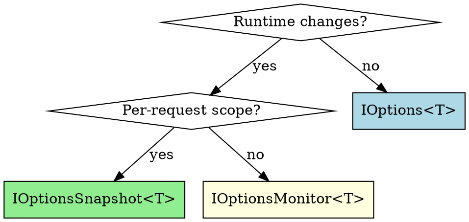

# Infrastructure Patterns

## Options Pattern & Validation (CRITICAL)

**MANDATORY: All configuration classes MUST use ValidateOnStart() to fail fast on invalid configuration.**

### IOptions Interface Selection



| Interface | Lifetime | Reload | Use When |
|-----------|----------|--------|----------|
| `IOptions<T>` | Singleton | No | Config won't change at runtime (most common) |
| `IOptionsSnapshot<T>` | Scoped | Per-request | Need consistent config within request + reload between requests |
| `IOptionsMonitor<T>` | Singleton | Real-time | Need live config changes + `OnChange()` notifications |

**Default choice:** Use `IOptions<T>` unless you specifically need runtime reload.

### MANDATORY: ValidateOnStart Pattern

**ALWAYS use `ValidateOnStart()` to fail immediately on invalid configuration.**

❌ **WRONG** (Fails at first use - hard to debug):
```csharp
builder.Services.AddOptions<DatabaseOptions>()
    .BindConfiguration("Database");
// App starts, then crashes when first request uses invalid config
```

✅ **CORRECT** (Fails immediately at startup):
```csharp
public class DatabaseOptions
{
    public const string Section = "Database";

    [Required(ErrorMessage = "ConnectionString is required")]
    public required string ConnectionString { get; init; }

    [Range(1, 100, ErrorMessage = "MaxPoolSize must be between 1 and 100")]
    public int MaxPoolSize { get; init; } = 10;

    [Range(1, 300, ErrorMessage = "CommandTimeout must be between 1 and 300 seconds")]
    public int CommandTimeout { get; init; } = 30;
}

// Registration - ALWAYS include all three methods
builder.Services.AddOptions<DatabaseOptions>()
    .BindConfiguration(DatabaseOptions.Section)
    .ValidateDataAnnotations()  // Validates [Required], [Range], etc.
    .ValidateOnStart();         // CRITICAL: Fails at startup, not at first use
```

### Complete Options Setup Pattern

```csharp
// 1. Define options class with C# 14 features
public class JwtOptions
{
    public const string Section = "Jwt";

    [Required]
    public required string Authority { get; init; }

    [Required]
    public required string Audience { get; init; }

    [Required, StringLength(256, MinimumLength = 32)]
    public required string SecretKey { get; init; }

    [Range(1, 1440)]
    public int TokenLifetimeMinutes { get; init; } = 60;

    [Range(1, 43200)]
    public int RefreshTokenLifetimeMinutes { get; init; } = 10080;
}

// 2. Register with validation
builder.Services.AddOptions<JwtOptions>()
    .BindConfiguration(JwtOptions.Section)
    .ValidateDataAnnotations()
    .ValidateOnStart();

// 3. Use in services (prefer IOptions for startup config)
public class TokenService(IOptions<JwtOptions> options)
{
    private readonly JwtOptions _config = options.Value;

    public string GenerateToken(User user) { /* use _config */ }
}
```

### IValidateOptions for Complex Validation

**Use when validation requires:**
- Cross-property validation
- Async validation (database/API calls)
- Conditional validation rules
- Custom error messages with context

```csharp
public class DatabaseOptionsValidator : IValidateOptions<DatabaseOptions>
{
    public ValidateOptionsResult Validate(string? name, DatabaseOptions options)
    {
        var errors = new List<string>();

        // Required field check
        if (string.IsNullOrWhiteSpace(options.ConnectionString))
            errors.Add("ConnectionString is required");

        // Format validation
        else if (!options.ConnectionString.Contains("Server=", StringComparison.OrdinalIgnoreCase))
            errors.Add("ConnectionString must contain 'Server=' component");

        // Cross-property validation
        if (options.MaxPoolSize > 50 && options.CommandTimeout < 60)
            errors.Add("High pool size requires CommandTimeout >= 60 seconds");

        // Environment-specific validation
        if (options.ConnectionString.Contains("localhost") &&
            Environment.GetEnvironmentVariable("ASPNETCORE_ENVIRONMENT") == "Production")
            errors.Add("Cannot use localhost connection string in Production");

        return errors.Count > 0
            ? ValidateOptionsResult.Fail(errors)
            : ValidateOptionsResult.Success;
    }
}

// Register the validator
builder.Services.AddSingleton<IValidateOptions<DatabaseOptions>, DatabaseOptionsValidator>();
```

### Named Options (Multiple Configurations)

```csharp
// Register multiple named configurations
builder.Services.AddOptions<DatabaseOptions>("Primary")
    .BindConfiguration("Database:Primary")
    .ValidateDataAnnotations()
    .ValidateOnStart();

builder.Services.AddOptions<DatabaseOptions>("Replica")
    .BindConfiguration("Database:Replica")
    .ValidateDataAnnotations()
    .ValidateOnStart();

// Access named options
public class DataService(IOptionsSnapshot<DatabaseOptions> options)
{
    public void UseReplica()
    {
        var replicaConfig = options.Get("Replica");
    }
}
```

### Options Validation Checklist

- [ ] Options class has `const string Section` for config path
- [ ] All required properties use `[Required]` attribute
- [ ] All required properties use `required` modifier (C# 14)
- [ ] Numeric properties have `[Range]` constraints
- [ ] String properties have `[StringLength]` where appropriate
- [ ] Registration uses `.ValidateDataAnnotations()`
- [ ] Registration uses `.ValidateOnStart()` (CRITICAL)
- [ ] Complex validation uses `IValidateOptions<T>`
- [ ] Error messages are descriptive and actionable

---

## HTTP Resilience (ALWAYS Use Built-in Handler)

**MANDATORY: Use `AddStandardResilienceHandler()` instead of manual Polly configuration.**

### Why Built-in Over Manual Polly

❌ **WRONG** (Manual Polly - Verbose, Error-Prone):
```csharp
// DON'T DO THIS - 30+ lines of error-prone configuration
builder.Services.AddHttpClient<IPaymentApi, PaymentClient>()
    .AddPolicyHandler(Policy
        .HandleResult<HttpResponseMessage>(r => !r.IsSuccessStatusCode)
        .WaitAndRetryAsync(3, i => TimeSpan.FromSeconds(Math.Pow(2, i))))
    .AddPolicyHandler(Policy
        .HandleResult<HttpResponseMessage>(r => r.StatusCode == HttpStatusCode.ServiceUnavailable)
        .CircuitBreakerAsync(5, TimeSpan.FromSeconds(30)))
    .AddPolicyHandler(Policy.TimeoutAsync<HttpResponseMessage>(10));
```

✅ **CORRECT** (.NET 10 Built-in - One Line):
```csharp
builder.Services.AddHttpClient<IPaymentApi, PaymentClient>()
    .AddStandardResilienceHandler();  // Includes ALL 5 strategies!
```

### Standard Handler Components (All Included Automatically)

| Strategy | Purpose | Default |
|----------|---------|---------|
| Rate Limiter | Limit concurrent requests | 1000 concurrent |
| Total Timeout | Overall timeout including retries | 30 seconds |
| Retry | Retry on transient failures (429, 5xx) | 3 attempts, exponential backoff |
| Circuit Breaker | Stop calling unhealthy dependencies | Opens after 10% failures |
| Attempt Timeout | Timeout for single attempt | 2 seconds |

### Customize Only When Needed

```csharp
builder.Services.AddHttpClient<IPaymentGateway, PaymentClient>()
    .AddStandardResilienceHandler(options =>
    {
        // Only override what you need
        options.Retry.MaxRetryAttempts = 5;
        options.Retry.Delay = TimeSpan.FromMilliseconds(500);
        options.CircuitBreaker.BreakDuration = TimeSpan.FromSeconds(60);
        options.AttemptTimeout.Timeout = TimeSpan.FromSeconds(10);
        options.TotalRequestTimeout.Timeout = TimeSpan.FromSeconds(120);
    });
```

### Hedging for Latency-Critical Services

```csharp
// Send parallel requests, use first successful response
builder.Services.AddHttpClient<ISearchService, SearchClient>()
    .AddStandardHedgingHandler(options =>
    {
        options.Hedging.MaxHedgedAttempts = 2;
        options.Hedging.Delay = TimeSpan.FromMilliseconds(200);
    });
```

### Complete Typed HttpClient Example

```csharp
// 1. Define interface and client
public interface IPaymentApi
{
    Task<PaymentResult> ProcessAsync(PaymentRequest request, CancellationToken ct);
}

public class PaymentApiClient(HttpClient http) : IPaymentApi
{
    public async Task<PaymentResult> ProcessAsync(PaymentRequest request, CancellationToken ct)
    {
        var response = await http.PostAsJsonAsync("/payments", request, ct);
        response.EnsureSuccessStatusCode();
        return await response.Content.ReadFromJsonAsync<PaymentResult>(ct)
            ?? throw new InvalidOperationException("Invalid response");
    }
}

// 2. Register with resilience (Program.cs)
builder.Services.AddHttpClient<IPaymentApi, PaymentApiClient>(client =>
{
    client.BaseAddress = new Uri(builder.Configuration["PaymentApi:BaseUrl"]!);
    client.DefaultRequestHeaders.Add("X-Api-Key", builder.Configuration["PaymentApi:Key"]!);
})
.AddStandardResilienceHandler();
```

---

## Channels (Producer/Consumer)

### Bounded Channel (Preferred)

```csharp
// Create with backpressure
var channel = Channel.CreateBounded<WorkItem>(new BoundedChannelOptions(100)
{
    FullMode = BoundedChannelFullMode.Wait, // Backpressure
    SingleWriter = false,
    SingleReader = true
});

// Register in DI
builder.Services.AddSingleton(channel);
builder.Services.AddSingleton(sp => sp.GetRequiredService<Channel<WorkItem>>().Reader);
builder.Services.AddSingleton(sp => sp.GetRequiredService<Channel<WorkItem>>().Writer);

// Producer (API endpoint)
app.MapPost("/work", async (WorkItem item, ChannelWriter<WorkItem> writer) =>
{
    await writer.WriteAsync(item);
    return TypedResults.Accepted();
});

// Consumer (background service)
public class WorkProcessor(ChannelReader<WorkItem> reader, ILogger<WorkProcessor> logger)
    : BackgroundService
{
    protected override async Task ExecuteAsync(CancellationToken ct)
    {
        await foreach (var item in reader.ReadAllAsync(ct))
        {
            try
            {
                await ProcessAsync(item);
            }
            catch (Exception ex)
            {
                logger.LogError(ex, "Failed to process {ItemId}", item.Id);
            }
        }
    }
}
```

### FullMode Options

| Mode | Behavior |
|------|----------|
| `Wait` | Producer waits (backpressure) - **recommended** |
| `DropNewest` | Drop incoming item |
| `DropOldest` | Drop oldest in queue |
| `DropWrite` | Silently fail write |

---

## Health Checks

```csharp
builder.Services.AddHealthChecks()
    .AddCheck("self", () => HealthCheckResult.Healthy(), tags: new[] { "live" })
    .AddDbContextCheck<AppDbContext>(tags: new[] { "ready" })
    .AddRedis(builder.Configuration["Redis:Connection"]!, tags: new[] { "ready" })
    .AddUrlGroup(new Uri("https://api.example.com/health"), "external-api", tags: new[] { "ready" });

var app = builder.Build();

// Basic endpoint
app.MapHealthChecks("/health");

// Detailed (internal only)
app.MapHealthChecks("/health/detailed", new HealthCheckOptions
{
    ResponseWriter = UIResponseWriter.WriteHealthCheckUIResponse
}).RequireAuthorization("AdminOnly");

// Kubernetes probes
app.MapHealthChecks("/health/live", new HealthCheckOptions
{
    Predicate = check => check.Tags.Contains("live")
});

app.MapHealthChecks("/health/ready", new HealthCheckOptions
{
    Predicate = check => check.Tags.Contains("ready")
});
```

---

## Caching

### In-Memory Cache

```csharp
builder.Services.AddMemoryCache();

public class ProductService(IMemoryCache cache, IProductRepository repo)
{
    public async Task<Product?> GetAsync(int id, CancellationToken ct)
    {
        var key = $"product:{id}";

        if (cache.TryGetValue(key, out Product? product))
            return product;

        product = await repo.GetAsync(id, ct);

        if (product is not null)
        {
            cache.Set(key, product, new MemoryCacheEntryOptions
            {
                AbsoluteExpirationRelativeToNow = TimeSpan.FromMinutes(5),
                SlidingExpiration = TimeSpan.FromMinutes(1)
            });
        }

        return product;
    }
}
```

### Distributed Cache (Redis)

```csharp
builder.Services.AddStackExchangeRedisCache(options =>
{
    options.Configuration = builder.Configuration["Redis:Connection"];
    options.InstanceName = "MyApp:";
});

public class SessionService(IDistributedCache cache)
{
    public async Task<UserSession?> GetSessionAsync(string sessionId, CancellationToken ct)
    {
        var data = await cache.GetStringAsync($"session:{sessionId}", ct);
        return data is null ? null : JsonSerializer.Deserialize<UserSession>(data);
    }

    public async Task SetSessionAsync(string sessionId, UserSession session, CancellationToken ct)
    {
        var options = new DistributedCacheEntryOptions
        {
            AbsoluteExpirationRelativeToNow = TimeSpan.FromHours(24),
            SlidingExpiration = TimeSpan.FromMinutes(30)
        };

        await cache.SetStringAsync(
            $"session:{sessionId}",
            JsonSerializer.Serialize(session),
            options,
            ct);
    }
}
```

### Output Caching (.NET 7+)

```csharp
builder.Services.AddOutputCache(options =>
{
    options.AddBasePolicy(builder => builder.Expire(TimeSpan.FromMinutes(5)));
    options.AddPolicy("Products", builder => builder
        .Expire(TimeSpan.FromMinutes(10))
        .Tag("products"));
});

app.UseOutputCache();

app.MapGet("/api/products", GetProducts.Handle)
    .CacheOutput("Products");

// Invalidate cache
app.MapPost("/api/products", async (IOutputCacheStore cache, ...) =>
{
    // ... create product
    await cache.EvictByTagAsync("products", ct);
});
```

---

## Structured Logging (Serilog)

```csharp
// Program.cs
Log.Logger = new LoggerConfiguration()
    .MinimumLevel.Information()
    .MinimumLevel.Override("Microsoft.AspNetCore", LogEventLevel.Warning)
    .Enrich.FromLogContext()
    .Enrich.WithEnvironmentName()
    .Enrich.WithMachineName()
    .WriteTo.Console(new CompactJsonFormatter())
    .WriteTo.Seq("http://localhost:5341")
    .CreateLogger();

builder.Host.UseSerilog();

var app = builder.Build();

// Request logging middleware
app.UseSerilogRequestLogging(options =>
{
    options.EnrichDiagnosticContext = (diagnosticContext, httpContext) =>
    {
        diagnosticContext.Set("UserId", httpContext.User.FindFirstValue("sub"));
        diagnosticContext.Set("ClientIP", httpContext.Connection.RemoteIpAddress);
    };
});
```

### Structured Logging in Handlers

```csharp
public static class CreateOrder
{
    public static async Task<Results<Created<OrderResponse>, BadRequest>> Handle(
        CreateOrderRequest request,
        IOrderService service,
        ILogger<CreateOrder> logger,
        CancellationToken ct)
    {
        using var _ = logger.BeginScope(new Dictionary<string, object>
        {
            ["CustomerId"] = request.CustomerId,
            ["OrderItems"] = request.Items.Count
        });

        logger.LogInformation("Creating order for customer {CustomerId}", request.CustomerId);

        var order = await service.CreateAsync(request, ct);

        logger.LogInformation("Order {OrderId} created successfully", order.Id);

        return TypedResults.Created($"/api/orders/{order.Id}", new OrderResponse(order));
    }
}
```

---

## EF Core Patterns

### DbContext Registration

```csharp
builder.Services.AddDbContext<AppDbContext>(options =>
    options.UseNpgsql(builder.Configuration.GetConnectionString("Default"))
           .UseSnakeCaseNamingConvention());

// For high-throughput scenarios
builder.Services.AddDbContextPool<AppDbContext>(options =>
    options.UseNpgsql(builder.Configuration.GetConnectionString("Default")));
```

### Query Patterns

```csharp
public static async Task<Results<Ok<UserResponse>, NotFound>> GetUser(
    int id,
    AppDbContext db,
    CancellationToken ct)
{
    var user = await db.Users
        .AsNoTracking()  // Read-only, better performance
        .Where(u => u.Id == id)
        .Select(u => new UserResponse(u.Id, u.Email, u.Name))  // Project to DTO
        .FirstOrDefaultAsync(ct);

    return user is not null
        ? TypedResults.Ok(user)
        : TypedResults.NotFound();
}
```

### Transaction Pattern

```csharp
public static async Task<Results<Created<OrderResponse>, BadRequest>> CreateOrder(
    CreateOrderRequest request,
    AppDbContext db,
    CancellationToken ct)
{
    var strategy = db.Database.CreateExecutionStrategy();

    return await strategy.ExecuteAsync(async () =>
    {
        await using var transaction = await db.Database.BeginTransactionAsync(ct);

        try
        {
            var order = new Order { /* ... */ };
            db.Orders.Add(order);
            await db.SaveChangesAsync(ct);

            // Other operations...

            await transaction.CommitAsync(ct);
            return TypedResults.Created($"/api/orders/{order.Id}", new OrderResponse(order));
        }
        catch
        {
            await transaction.RollbackAsync(ct);
            throw;
        }
    });
}
```

---

## Keyed Services (.NET 8+)

```csharp
// Register multiple implementations with keys
builder.Services.AddKeyedScoped<INotificationService, EmailService>("email");
builder.Services.AddKeyedScoped<INotificationService, SmsService>("sms");
builder.Services.AddKeyedScoped<INotificationService, PushService>("push");

// Inject specific implementation
app.MapPost("/notify/email", async (
    [FromKeyedServices("email")] INotificationService notifier,
    NotifyRequest request) =>
{
    await notifier.SendAsync(request.Message);
    return TypedResults.Ok();
});

// Dynamic resolution
app.MapPost("/notify/{channel}", async (
    string channel,
    IServiceProvider sp,
    NotifyRequest request) =>
{
    var notifier = sp.GetKeyedService<INotificationService>(channel);
    if (notifier is null) return TypedResults.NotFound();
    await notifier.SendAsync(request.Message);
    return TypedResults.Ok();
});
```

---

## Error Handling (RFC 9457)

```csharp
builder.Services.AddProblemDetails(options =>
{
    options.CustomizeProblemDetails = ctx =>
    {
        ctx.ProblemDetails.Extensions["traceId"] = ctx.HttpContext.TraceIdentifier;
        ctx.ProblemDetails.Extensions["requestPath"] = ctx.HttpContext.Request.Path.Value;
    };
});

app.UseExceptionHandler();
app.UseStatusCodePages();

// Custom exception mapping
app.UseExceptionHandler(errorApp =>
{
    errorApp.Run(async ctx =>
    {
        var exception = ctx.Features.Get<IExceptionHandlerFeature>()?.Error;
        var problemDetails = exception switch
        {
            ValidationException ve => new ProblemDetails
            {
                Status = 400, Title = "Validation Error", Detail = ve.Message
            },
            NotFoundException => new ProblemDetails
            {
                Status = 404, Title = "Not Found"
            },
            UnauthorizedAccessException => new ProblemDetails
            {
                Status = 403, Title = "Forbidden"
            },
            _ => new ProblemDetails
            {
                Status = 500, Title = "Internal Server Error"
            }
        };

        ctx.Response.StatusCode = problemDetails.Status ?? 500;
        await ctx.Response.WriteAsJsonAsync(problemDetails);
    });
});
```
